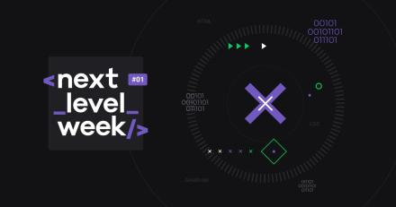

# Ecoleta
Treinamento Rocketseat - Semana NLW

<h1 align="center">
    Next Level Week by  
</h1>
  

  

_________

### 🤔 Sobre o que se trata ? 
A NLW é uma experiência online criada pela <a href="https://rocketseat.com.br/">Rocketseat</a> de uma semana com muito conteúdo prático, desafios, hacks e um projeto que nos ajudam a avançar para o próximo nível e impulsionar a nossa carreira. 🤩🤩
  
### ✨ Sobre o projeto:

O Ecoleta é um projeto criado para gerenciar o processo de coleta de lixo nas cidades. Com ele, é possível ajudar pessoas a encontrarem pontos de coleta de uma forma mais eficiente.
 
 ## Técnologias usadas:

## Front-end:

* HTML
* CSS
* JavaScript
* Template engine: Nunjucks

## Back-end:

* Node.js
* Express
* SQLite
 
<h2 align="center"> 📷 Screenshot da home page do projeto: </h2>

